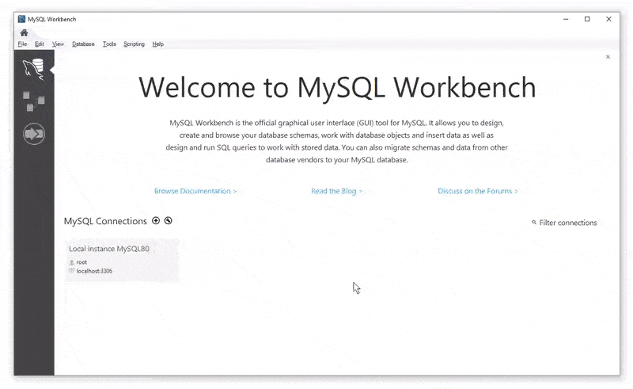

# Inventory-Management
A proof of concept store inventory interaction CLI using SQL

## Getting Started

Download the repository. Then, navigate to the folder and run install from your node package manager. If everything is installed, when you run `bew.js`, you should get a screen like this:


Just follow the on screen instructions to explore the customer-side interface of my inventory management app. 


If you pass `employee` as a command line argument, you'll be able to dive into the employee menus. Or, if you want to dive directly into a specific employee interface, you can use the `manager` or `supervisor` argument instead of employee.


The manager interface allows you to see the current stock or just the products that are running low in inventory. You can also add more stock to an existing item or register a new item altogether.


The supervisor interface tracks the total profit on purchases made with the customer interface. It also factors in overhead costs for each department as specified in the accompanying SQL table. Supervisors can also create new departments that will be reflected when they view the total profits afterwards.

### Prerequisites

You must have node installed in your terminal with support for the Node Package Manager. Also, you must have a local SQL server that you've initialised with the provided schema.

### Installing

[MySQL Website](https://www.mysql.com/)

Now we need to install MySQL. Navigate to the MySQL website and install the workbench and the local server. 



Once you have them installed, start up your local database and use the provided `schema.sql` and `seeds.sql` files to initialize the database we're going to be using for this app. Make sure to execute `schema.sql` first! That has the blueprint for the database that we're going to seed with our initial dataset with `seeds.sql`.

[Node.js Website](https://nodejs.org/en/)

Navigate to the Node.js website and follow the instructions to install Node. Then navigate to the project folder in your terminal.
```
/.../Inventory-Management/
```

Within that folder, run
```
npm install
```
Now, you're ready! Just run
```
node bew.js
```

or

```
node bew.js employee
node bew.js manager
node bew.js supervisor
```


## Built With

* [Javascript](https://www.javascript.com/) - The scripting language used

* [SQL]() - Database management language

* [MySQL](https://www.mysql.com/) - Local Database hosting and management

* [Node.js](https://nodejs.org/en/) - JavaScript runtime

* [Node Package Manager](https://www.npmjs.com/) - Package manager for JavaScript and Node

* [Inquirer](https://www.npmjs.com/package/inquirer) - Command line user interface

* [mysql](https://www.npmjs.com/package/mysql) - Interface with SQL database

* [cli-table](https://www.npmjs.com/package/cli-table) - Display tables in the terminal

## Challenges


This project was my first time diving deep into SQL and its interactions with the backend. I had an interesting time figuring out how the different joins behave. This single SQL query best demonstrates combining several components together in a meaningful way.


I reused my function that displayed the items for sale in both the customer interface and the manager interface by passing in a callback function. I'm always on the lookout for ways to streamline my code.


This is a series of functions I wrote to help with aligning text in the terminal. I use these to automatically center messages and create my own table-like display of the items for sale in the inquirer prompts. They're pretty simple, but I did feel pretty clever after I made them since they saved a lot of time.

## Authors

* **Robert Shaw** - *Initial work* - [robertshaw87](https://github.com/robertshaw87)
